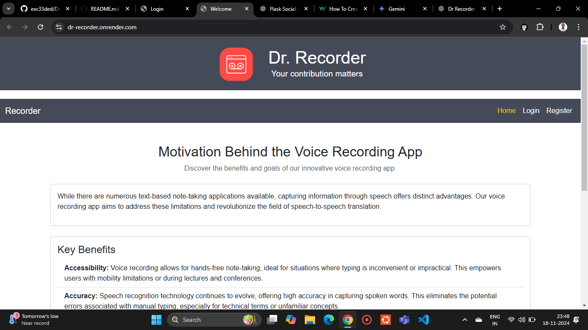
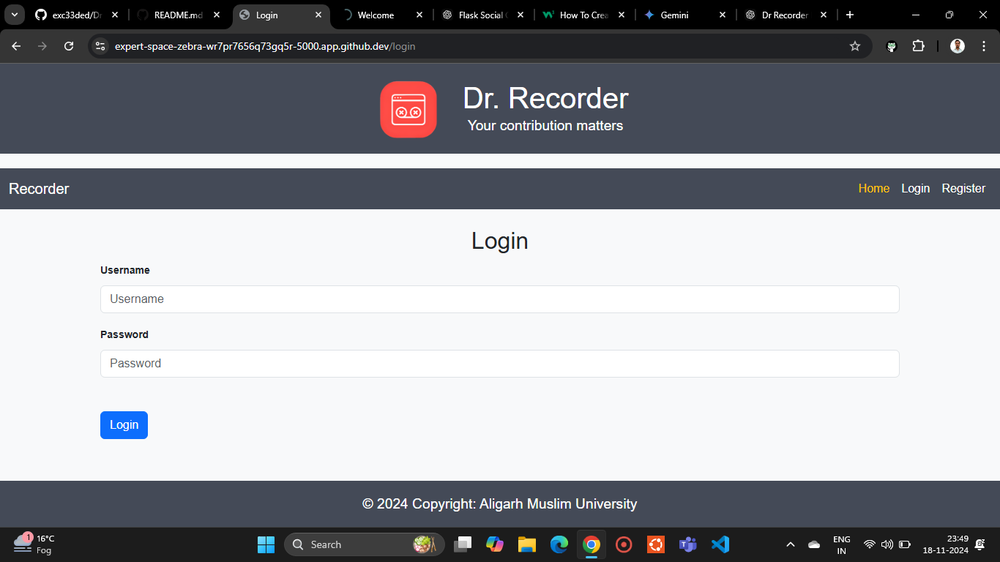
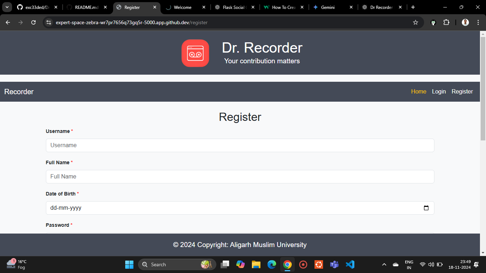
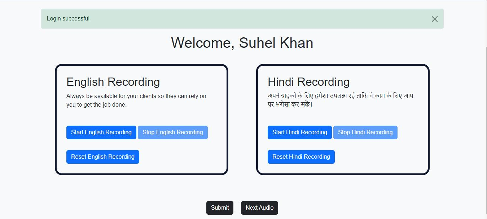

# Dr. Recorder 🎙️

- Dr. Recorder is an intuitive and versatile application designed to seamlessly capture and store audio recordings in both Hindi and English. It serves as a comprehensive database for managing your audio files, while also bridging the gap between Hindi and English through direct speech-to-speech translation. Whether for personal use, professional needs, or language learning, Dr. Recorder makes audio recording, storage, and translation effortless and efficient.

---  
## Table of Contents
- [Dr. Recorder 🎙️](#dr-recorder-️)
  - [Table of Contents](#table-of-contents)
  - [Features](#features)
  - [**Installation**](#installation)
  - [**Usage**](#usage)
  - [**Contributing**](#contributing)
  - [**Preview**](#preview)
    - [Welcome Page](#welcome-page)
    - [Login Page](#login-page)
    - [Register Page](#register-page)
    - [Index Page](#index-page)

## Features
- 🎤 Easy-to-use audio recording functionality
- ⚙️ Customizable settings for optimal recording
- 📁 Save recordings in multiple formats
- 🖥️ Command-line and optional GUI support

## **Installation**
- Dr. Recorder requires a few things to run smoothly:
1. **Prerequisites:**
   - Python 3.x
   - pip (Python package manager)

2. **Installation:**
   - Clone the repository:
     ```bash
     git clone https://github.com/exc33ded/Dr-Recorder
     ```
   - Install dependencies:
     ```bash
     step 1: cd Dr-Recorder
     step 2: pip install -r requirements.txt
     ```

## **Usage**
- Now that everything is set up, you're ready to start recording!

Run the application:

In your terminal window, type this command and press Enter:

```bash
python app.py
```

## **Contributing**
We welcome contributions! Follow these steps to contribute:

1. Fork the repository.
2. Create a new branch.
3. Submit a pull request.

## **Preview**
Below is a sneak peek of Dr. Recorder in action, showcasing its user-friendly interface and seamless functionality:

**Command-Line Interface (CLI)**
The command-line version of Dr. Recorder allows you to start, pause, and stop recordings easily using simple commands.

**Graphical User Interface (GUI) (Optional)**
The GUI mode provides an intuitive interface for recording and managing your audio files.

**Recording in Progress**
Real-time recording with visual indicators to track your progress.

**Submit Recordings**
Submit all your saved audio files in an organized manner. These recordings will help us to trained a **Deep Learning** model for translating speech to text.

### Welcome Page


### Login Page


### Register Page


### Index Page


